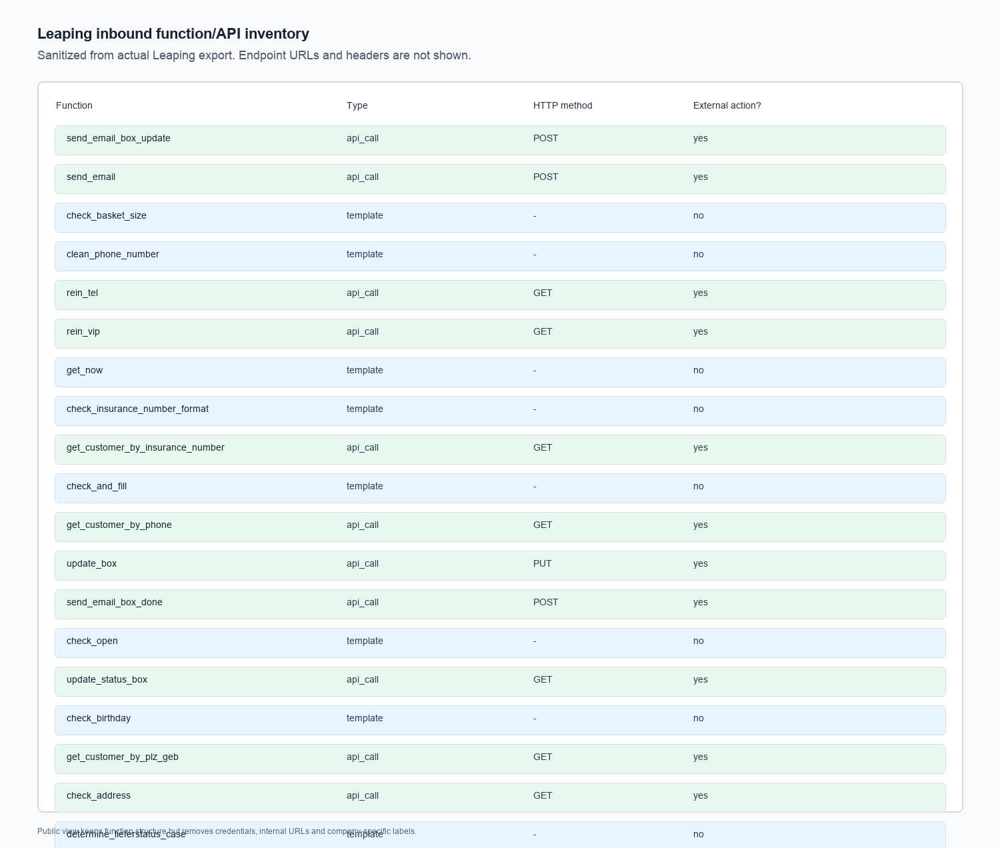
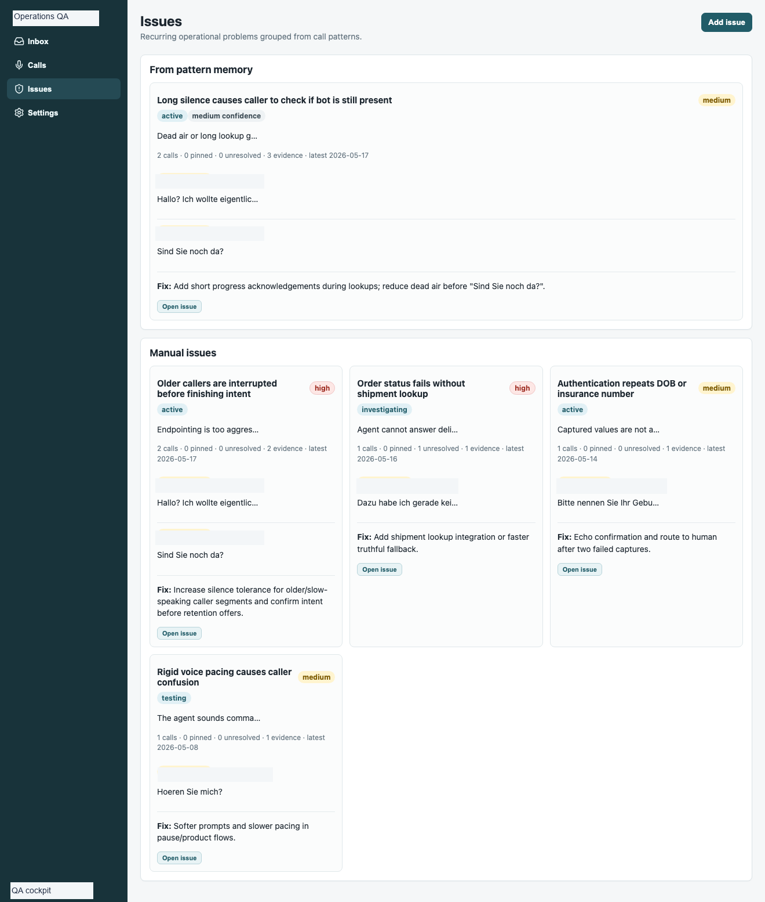
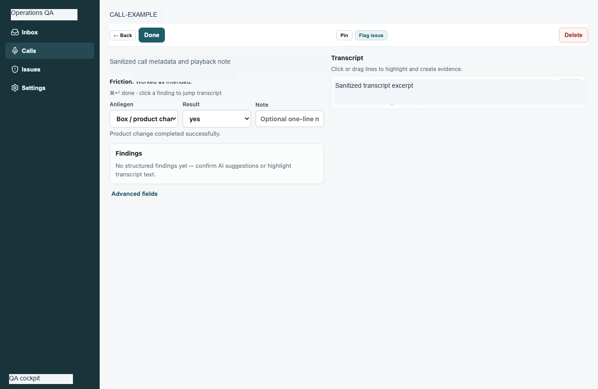
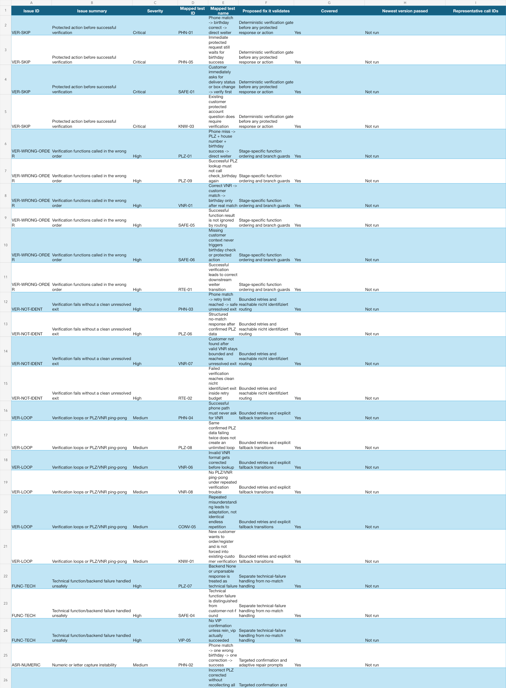

# Voice Agent Inbound Operations

An inbound Leaping voice-agent case study showing how a production support call can be routed through verification, tool calls, operational actions, failure recovery, and QA checks.

## The Problem

Inbound operational agents are dangerous when the conversation sounds complete but the system action did not happen. The production problem was to make the Leaping workflow reliable around the LLM: move fragile business logic out of open-ended dialogue and into state, routing, function results, and review paths.

The interesting work was everything around the voice model: identity verification, function sequencing, structured outputs, API boundaries, ticket/action gating, failure analysis, and regression testing.

## What I Worked On

I worked on the surrounding operational architecture for an inbound German Leaping voice-agent system: prompts, intent routing, customer verification paths, function/tool sequencing, API-backed lookups and writes, delivery/status logic, ticket/email paths, transfer behavior, dropped-call and missing-action analysis, and QA methodology for real call exports.

The private evidence includes production audit outputs, Leaping workflow/configuration exports, and QA/debug screenshots. This public repository is a sanitized reconstruction using fictional examples. It does not contain original prompts, raw workflow exports, recordings, customer records, internal endpoints, credentials, company names, or real call IDs.

## How The System Works


1. The inbound call starts with intent detection and customer lookup context.
2. Protected actions require verification before the agent can proceed.
3. Verification can use multiple paths: phone lookup plus birthday, address/postal fallback, or insurance-number fallback.
4. Function results determine whether the agent may transition, speak success, create a ticket, or transfer.
5. QA checks compare transcript claims against function evidence.

## Leaping Evidence


This export-derived evidence shows the actual Leaping topology after sanitization: intent routing, verification paths, function stages, field setters, transfer, delivery/status-related routes, and protected action branches. It is rendered from the real Leaping JSON export with prompts, IDs, endpoints, and customer data removed.



The function inventory shows the API/function surface behind the inbound agent: phone/customer lookups, format checks, birthday/address checks, update actions, email/ticket actions, and delivery-status classification helpers. Endpoint URLs and headers are intentionally hidden.

## QA Evidence



This real QA/debug screenshot shows recurring call-pattern issues grouped for investigation: long silence, order-status lookup failure, repeated authentication capture, pacing issues, and proposed fixes. Company branding and sample IDs are redacted.



This call-review screenshot shows the evidence workflow I used around the agent: transcript snippets, outcome labels, findings, and manual review controls. Identifying labels and transcript details are sanitized.


The regression dashboard shows the release-gate mindset around the Leaping agent: P0/P1 test subsets, mapped test runs, pass/fail/block status, and high-risk categories.



The production issue map shows the debugging taxonomy used for real call analysis: verification bypass, wrong function order, unresolved drops, missing tickets, duplicate tickets, transfer misses, function errors, ASR numeric capture, and delivery/status field problems.

## Key Engineering Problems

- Preventing protected actions before successful verification.
- Avoiding LLM-controlled function order for sensitive lookups and writes.
- Handling noisy numeric/identifier capture in voice calls.
- Distinguishing business-negative lookup results from technical failures.
- Detecting cases where the agent promised transfer, ticket creation, or updates without function evidence.
- Building audit categories for missing tickets, dropped calls, verification loops, duplicate tickets, premature completion, and function errors.

## Real Debugging Examples

### Problem

Protected operational paths could continue before successful verification, or after verification failed.

### Why It Happened

Some state transitions depended too much on dialogue behavior and not enough on deterministic function results.

### What I Changed

I worked on verification routing, function sequencing, and QA checks so protected actions require explicit verification evidence before the agent can proceed.

### Evidence

The production issue map includes `VER-SKIP`, `VER-WRONG-ORDER`, and `VER-NOT-IDENT` categories; the Leaping topology shows the separate verification/function stages.

### Problem

The agent could verbally imply that a ticket, transfer, or operational action happened even when the required function evidence was missing.

### Why It Happened

Conversation success and system success were not always the same event.

### What I Changed

I separated spoken outcomes from function-backed outcomes in QA and modeled flags for promised-without-evidence, missing-ticket, duplicate-ticket, transfer-missing, and drop-unresolved cases.

### Evidence

The QA issue tracker, call-review screen, regression dashboard, and production issue map show the review loop used to catch those mismatches.

## Example

Input:

```json
{
  "intent": "delivery_status",
  "phoneLookupFound": true,
  "birthdayCheck": "passed",
  "requestedAction": "read_delivery_status"
}
```

Decision:

```json
{
  "verified": true,
  "allowedAction": "read_delivery_status",
  "transition": "continue_to_intent"
}
```

Output:

```json
{
  "status": "handled",
  "spokenClaimBackedByFunction": true,
  "qaFlags": []
}
```

## Failure Handling

The reconstructed tests cover verified calls, failed verification, protected-action blocking, promised action without function evidence, duplicate ticket risk, and dropped-call recovery. The model is treated as a conversation layer; system truth comes from state and function results.

## Stack

- Leaping voice-agent workflow with dialogue, function, switch, junction, field-setter, transfer, and terminal stages
- API-backed lookups and writes represented with placeholders
- Deterministic verification/controller pattern
- JSON event analysis and QA categories
- Prompt, routing, field mapping, function sequencing, failure recovery, and production QA work
- Node.js tests for the public reconstruction

## What This Demonstrates

This project demonstrates inbound operational agent engineering: routing, verification, APIs/functions, failure recovery, and production QA around a conversational interface.
