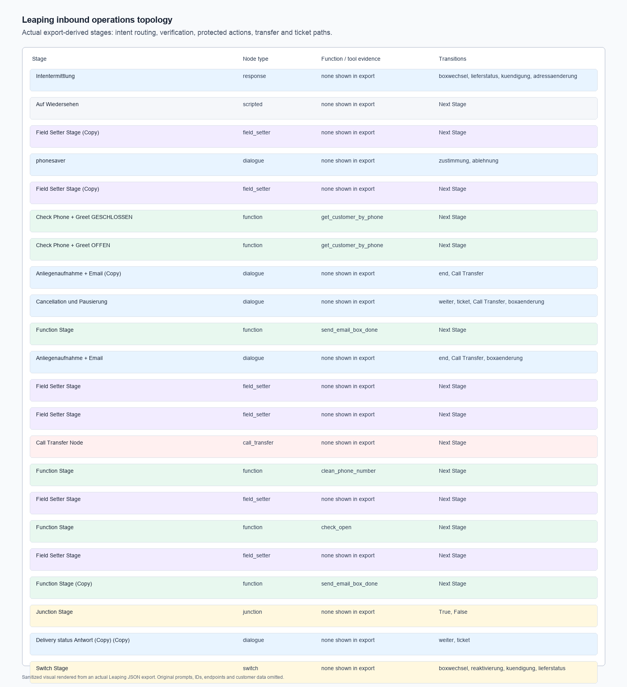
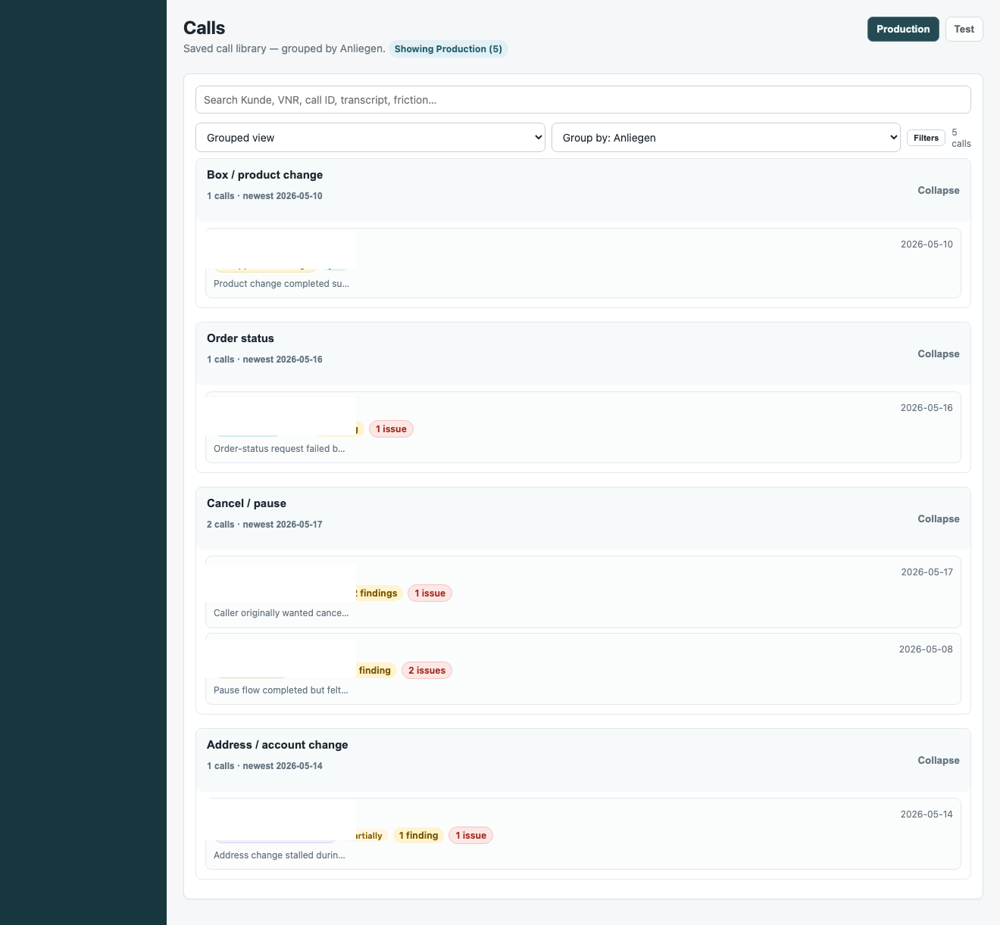
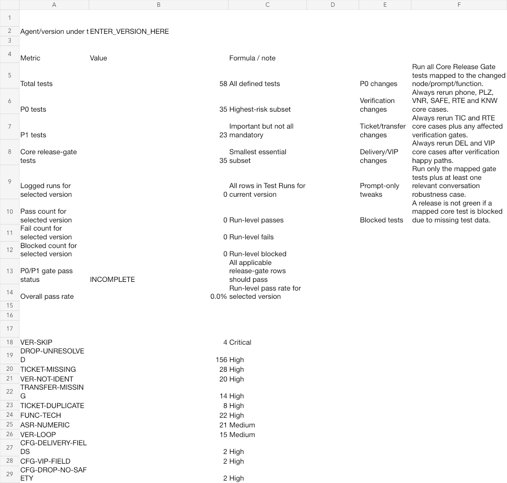

# Voice Agent Inbound Operations

Public-safe case study of an inbound Leaping voice-agent system for operational support calls.

This repo is about the work around the LLM: verification, routing, deterministic functions, delivery/status logic, structured ticketing, failure recovery, call-export analysis, and regression testing. The goal was to move from prompt-tweaking toward an observable production system.


## What This Proves

The system matured from a mostly prompt-controlled voice bot into a measured operational workflow:

- protected actions require verification evidence
- delivery/status answers depend on backend fields, not speculation
- tickets and transfers are checked against function evidence
- production issues become regression scenarios
- success wording is tied to backend proof

The strongest theme is not “better prompts.” It is converting voice-agent behavior into software that can be observed, tested, constrained, and gradually automated.

## My Work

- Audited large production call cohorts instead of relying on individual bad-call anecdotes.
- Redesigned verification routing around phone, address/postal, and identifier fallback paths.
- Investigated authentication bypass, wrong function order, verification loops, missing tickets, duplicate tickets, transfer misses, and false success claims.
- Helped move delivery/status logic from LLM reasoning into backend-driven fields and deterministic date cases.
- Built QA categories and regression mapping for high-risk production failures.
- Worked on structured ticketing, new-customer callback handoff, material-change actions, and action-proof rules.
- Helped introduce deterministic MCP/backend components so the agent could converse while code made sensitive decisions.

## Evidence Included



Export-derived topology from real Leaping JSON: intent routing, verification paths, function stages, field setters, transfer, delivery/status routes, and protected action branches.



Real call-review evidence with identifiers removed. It keeps the useful proof visible: production/test grouping, issue categories, findings counts, and review organization.



Regression evidence showing the release-gate mindset: P0/P1 tests, mapped issue classes, pass/fail/block status, and high-risk categories.

More detail:

- [Implementation notes](docs/implementation-notes.md)
- [Sanitized call evidence](docs/call-evidence.md)
- [Evidence audit](docs/evidence-audit.md)
- [Flow notes](docs/flow.md)

## Selected Production Evidence

These numbers are included carefully because audit definitions changed over time. They should be read as evidence of production measurement and directional system maturity, not as a formal causal experiment.

| Evidence area | Public-safe summary |
| --- | --- |
| July production audit | 500 calls reviewed for unresolved drops, missing tickets, function issues, ASR/numeric instability, verification loops, transfer misses, duplicate tickets, and premature completion |
| Verification audit | 416-call cohort found route-specific problems, including phone birthday bypass and PLZ/VNR recovery issues |
| September verification cohort | 654 calls entered verification; 531 verified successfully and 527 continued normally |
| Phone verification shift | late-July phone route: 99/195 successful; Sep 10-22 phone route: 296/346 positive verification |
| Regression system | 58 regression cases, including 35 P0/core release-gate cases |
| Call export evidence | sanitized aggregate from a 4,968-record Leaping call export |

## Public Reconstruction

The code in this repo models the key rule:

```json
{
  "verification": "passed",
  "requestedAction": "protected_operation",
  "functionEvidence": "present"
}
```

Only then can the reconstructed controller allow the protected action. If the agent promises an action without function evidence, the QA layer flags it.

## Run The Tests

```bash
npm test
```

The tests cover verified calls, failed verification, protected-action blocking, promised action without function evidence, duplicate-ticket risk, and dropped-call recovery.

## Privacy

This public version does not include original prompts, raw workflow exports, recordings, customer records, internal endpoints, credentials, company names, real call IDs, phone numbers, or transcripts. Screenshots and call-export examples are redacted or aggregated.
