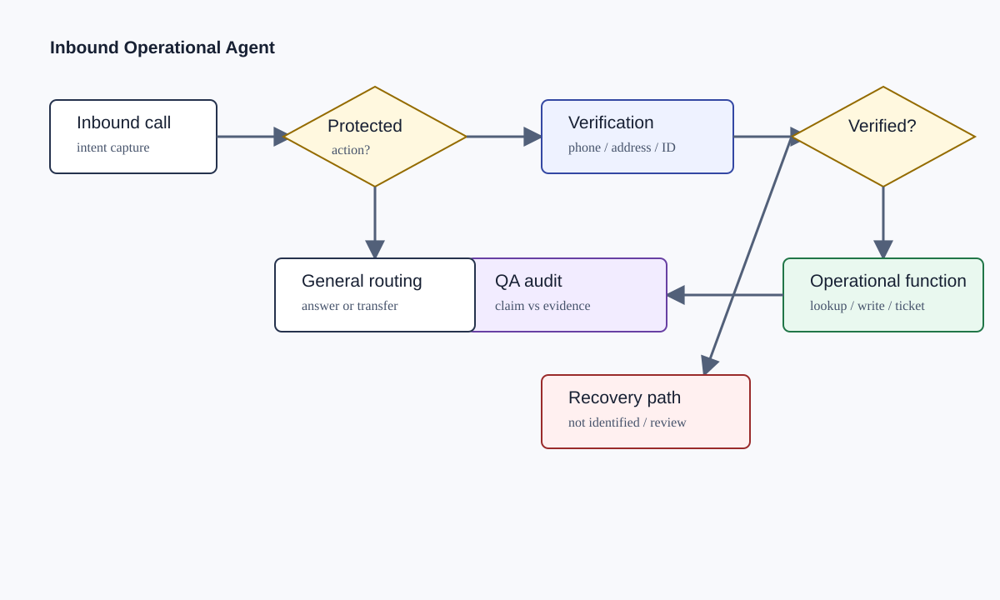

# Voice Agent Inbound Operations

An inbound voice-agent case study showing how a production support call can be routed through verification, tool calls, operational actions, failure recovery, and QA checks.

## The Problem

Inbound operational agents are dangerous when the conversation sounds complete but the system action did not happen. The production problem was to move fragile business logic out of open-ended dialogue and into reliable state, routing, function results, and review paths.

The interesting work was everything around the voice model: identity verification, function sequencing, structured outputs, API boundaries, ticket/action gating, failure analysis, and regression testing.

## What I Worked On

I worked on the surrounding operational architecture for an inbound German voice-agent system: intent routing, customer verification paths, function/tool sequencing, API-backed lookups and writes, delivery/status logic, ticket/email paths, transfer behavior, dropped-call and missing-action analysis, and QA methodology for real call exports.

The private evidence includes production audit outputs and workflow/configuration exports. This public repository is a sanitized reconstruction using fictional examples. It does not contain original prompts, workflow exports, transcripts, recordings, customer records, internal endpoints, credentials, company names, or real call IDs.

## How The System Works



1. The inbound call starts with intent detection and customer lookup context.
2. Protected actions require verification before the agent can proceed.
3. Verification can use multiple paths: phone lookup plus birthday, address/postal fallback, or insurance-number fallback.
4. Function results determine whether the agent may transition, speak success, create a ticket, or transfer.
5. QA checks compare transcript claims against function evidence.

## Key Engineering Problems

- Preventing protected actions before successful verification.
- Avoiding LLM-controlled function order for sensitive lookups and writes.
- Handling noisy numeric/identifier capture in voice calls.
- Distinguishing business-negative lookup results from technical failures.
- Detecting cases where the agent promised transfer, ticket creation, or updates without function evidence.
- Building audit categories for missing tickets, dropped calls, verification loops, duplicate tickets, premature completion, and function errors.

## Example

Input:

```json
{
  "intent": "delivery_status",
  "phoneLookupFound": true,
  "birthdayCheck": "passed",
  "requestedAction": "read_delivery_status"
}
```

Decision:

```json
{
  "verified": true,
  "allowedAction": "read_delivery_status",
  "transition": "continue_to_intent"
}
```

Output:

```json
{
  "status": "handled",
  "spokenClaimBackedByFunction": true,
  "qaFlags": []
}
```

## Failure Handling

The reconstructed tests cover verified calls, failed verification, protected-action blocking, promised action without function evidence, duplicate ticket risk, and dropped-call recovery. The model is treated as a conversation layer; system truth comes from state and function results.

## Stack

- Voice-agent workflow with dialogue, function, switch, junction, field-setter, transfer, and terminal stages
- API-backed lookups and writes represented with placeholders
- Deterministic verification/controller pattern
- JSON event analysis and QA categories
- Node.js tests for the public reconstruction

## What This Demonstrates

This project demonstrates inbound operational agent engineering: routing, verification, APIs/functions, failure recovery, and production QA around a conversational interface.
