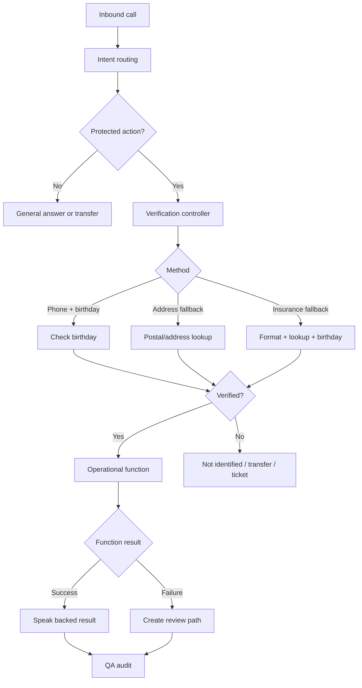

# Architecture

## Private Evidence Used

- Local inbound workflow/configuration exports with intent routing, verification, functions, switch/junction stages, transfer, ticket/email, and delivery/status-related fields.
- Private handoff material describing production safety rules, deterministic verification direction, and function-result gating.
- A local production audit report summarizing failure categories and call-analysis methodology.

## Sanitization

Excluded from this public reconstruction:

- Original company workflow exports and proprietary prompts
- Real customer, call, ticket, account, phone, address, insurance, transcript, and recording data
- Company names, employee names, branding, and internal endpoints
- Secrets, tokens, authorization headers, and deployment details
